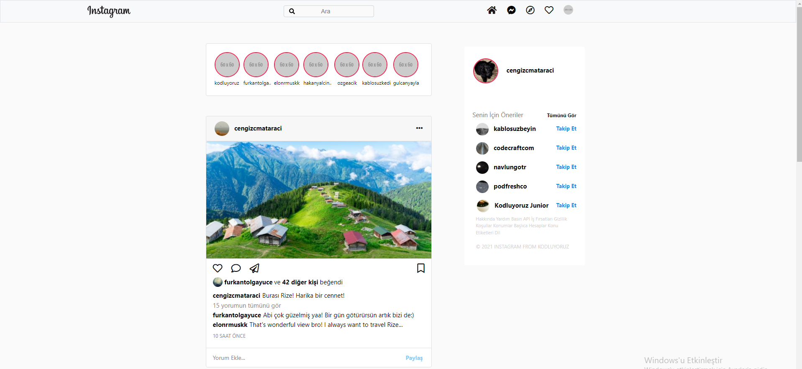
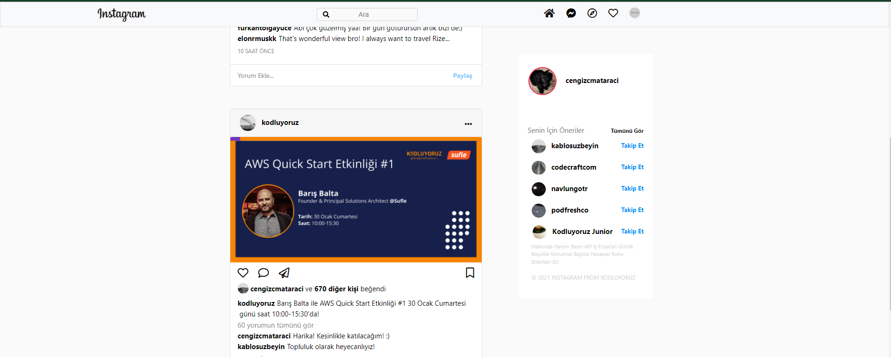

# CSS Patika **Bootstrap Homework II** (Instagram Clone)

## | Instagram Clone With Bootstrap

* `index.html` This project's Instagram clone. I tried and I used to Bootstrap

## | **I'm trying for progress** İf you have offer, I listen to you. Thank you... **mad love, peace out 🕊**

